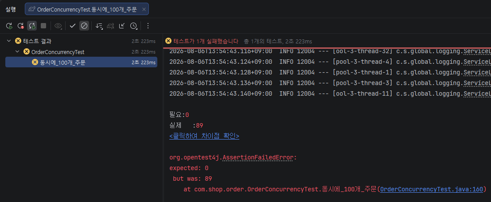
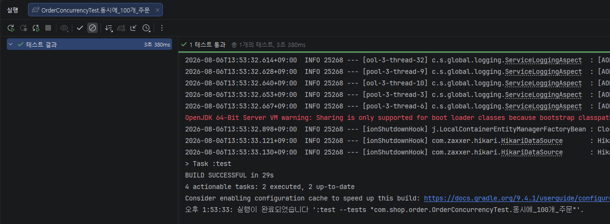

# E-commerce Backend Project

<br/>

## 📖 프로젝트 소개

Spring Boot 기반 이커머스 백엔드 프로젝트  

<br/>

## ✨ 주요 기능

*   **회원 관리:** 회원가입, 로그인(OAuth2를 이용한 소셜 로그인 기능) 
*   **상품 관리:** 상품 등록, 조회, 수정, 삭제 / 카테고리 등록, 조회, 수정, 삭제
*   **주문 관리:** 상품 주문, 주문 조회, 주문 취소 기능
*   **장바구니:** 사용자가 원하는 상품을 담고 관리
*   **Q&A:** 상품 및 주문에 대한 고객 문의를 처리하는 Q&A
*   **관리자:** 관리자 전용 페이지를 통해 매출 조회, 회원, 상품, 주문, 재고 관리 등 시스템의 전반적인 데이터 관리  

<br/>

## 🛠️ 기술 스택

*   **Language:** Java 17
*   **Framework:** Spring Boot 4.0.5
*   **Database:** MySQL 8.0.41, JPA 4.0.5
*   **Security:** Spring Security, OAuth2, JWT  

<br/>

## 📅 개발 기간
* 2026.03 ~  

<br/>

## 📝 API 문서

*   **Swagger UI:** `https://jhm0919.github.io/swagger-ui/`  

<br/>

## 🎯 트러블 슈팅
1. 문제 정의
   * 재고 100개 상품에 대해 동시에 100건 주문 시, 11건의 주문만 처리되고 89개의 재고가 남는 동시성 문제 발생


2. 관측 결과
   * `OrderService.createOrder`
   
   ```
   @Transactional
    public OrderDetailResponse createOrder(
            Long memberId,
            CreateOrderRequest request
    ) {
        List<OrderItem> items = new ArrayList<>();

        for (CreateOrderRequest.OrderItemRequest req : request.items()) {
            Product product = productRepository.findById(req.productId())
                    .orElseThrow(() -> new ProductNotFoundException(req.productId()));

            if (!product.isPurchasable()) { // 상품 상태가 ACTIVE이면 통과
                throw new ProductNotPurchasableException(product.getId());
            }

            Sku sku = product.findSkuById(req.skuId());

            product.decreaseSkuStock(req.skuId(), req.quantity());

            items.add(OrderItem.of(product, sku, req.quantity()));
        }

        ...
   ```

   * `OrderConcurrencyTest.동시에_100개_주문`
   
   ```
   @Test
    public void 동시에_100개_주문() throws InterruptedException {
        int threadCount = 100;

        ExecutorService executorService = Executors.newFixedThreadPool(32);
        CountDownLatch latch = new CountDownLatch(threadCount);

        for (int i = 0; i < threadCount; i++) {
            executorService.submit(() -> {
                try {
                    orderService.createOrder(1L, createRequest());
                } finally {
                    latch.countDown();
                }
            });
        }

        latch.await();

        Product product = productRepository.findById(productId).orElseThrow(() -> new ProductNotFoundException(productId));

        List<Sku> skus = product.getSkus();

        int quantity = 0;

        for (Sku sku : skus) {
            quantity += sku.getQuantity();
        }

        assertThat(quantity).isEqualTo(0);
    }
   ```

* 원인은 재고 차감 시점에 락이 없어서 다른 스레드들이 같은 재고 값을 동시에 읽고 각각 차감해렸기 때문
* 트랜잭션만으로는 요청 간 경쟁을 막을 수 없기 때문에 product 조회 시점에 비관적 락을 적용

### 해결 방식
- `PESSIMISTIC_WRITE` 락 적용
```
    @Lock(LockModeType.PESSIMISTIC_WRITE)
    @Query("""
                SELECT p
                FROM Product p
                LEFT JOIN FETCH p.skus s
                WHERE p.id = :productId
            """)
    Optional<Product> findByIdWithPessimistic(@Param("productId") Long productId);
```
- 락이 걸린 Product에 직접 재고 차감을 수행한다.
- 같은 SKU에 대한 동시 주문은 앞선 트랜잭션이 끝날 때까지 대기하게 만든다.
```
@Transactional
    public OrderDetailResponse createOrder(
            Long memberId,
            CreateOrderRequest request
    ) {
        List<OrderItem> items = new ArrayList<>();

        for (CreateOrderRequest.OrderItemRequest req : request.items()) {
            Product product = productRepository.findByIdWithPessimistic(req.productId())
                    .orElseThrow(() -> new ProductNotFoundException(req.productId()));

            if (!product.isPurchasable()) { // 상품 상태가 ACTIVE이면 통과
                throw new ProductNotPurchasableException(product.getId());
            }

            Sku sku = product.findSkuById(req.skuId());

            product.decreaseSkuStock(req.skuId(), req.quantity());

            items.add(OrderItem.of(product, sku, req.quantity()));
        }
        ...
```

- 검증 결과, 동시 주문 테스트에서 재고 1개 SKU에 대해 주문 2건이 동시에 성공하던 문제가 사라졌고
최종 주문 수와 재고 상태가 기대값과 일치하는 것을 확인


