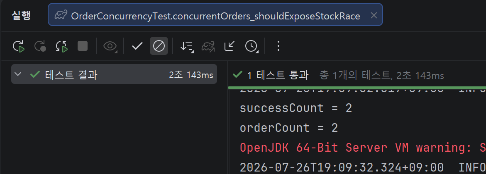
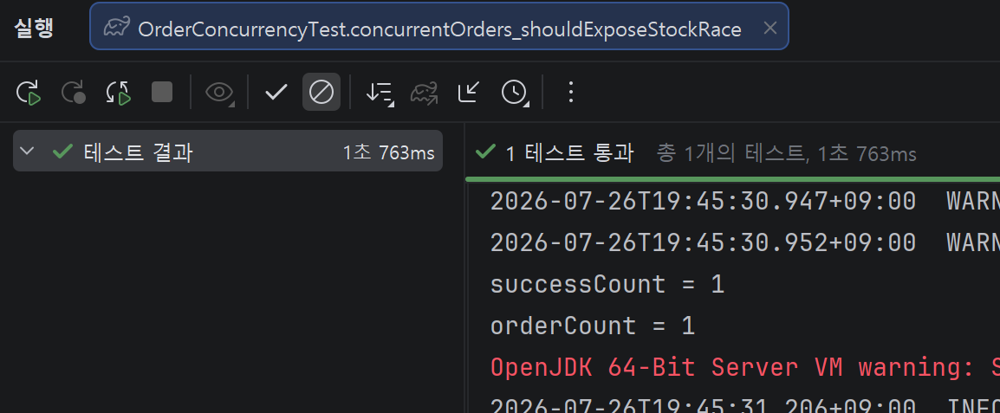

# E-commerce Project Backend

## 📖 프로젝트 소개

Spring Boot 기반 이커머스 백엔드 프로젝트 

## ✨ 주요 기능

*   **회원 관리:** 회원가입, 로그인(OAuth2를 이용한 소셜 로그인 기능) 
*   **상품 관리:** 상품 등록, 조회, 수정, 삭제 / 카테고리 등록, 조회, 수정, 삭제
*   **주문 관리:** 상품 주문, 주문 조회, 주문 취소 기능
*   **장바구니:** 사용자가 원하는 상품을 담고 관리
*   **Q&A:** 상품 및 주문에 대한 고객 문의를 처리하는 Q&A
*   **관리자:** 관리자 전용 페이지를 통해 매출 조회, 회원, 상품, 주문, 재고 관리 등 시스템의 전반적인 데이터 관리

## 🛠️ 기술 스택

*   **Language:** Java 17
*   **Framework:** Spring Boot 4.0.5
*   **Database:** MySQL 8.0.41, JPA 4.0.5
*   **Security:** Spring Security, OAuth2, JWT

## 📅 개발 기간
* 2026.03 ~

## 📝 API 문서

*   **Swagger UI:** `https://jhm0919.github.io/swagger-ui/`

## 🎯 트러블 슈팅
1. 문제 정의
   * 재고 1개 상품에 대해 동시에 2건 주문 시, 둘 다 주문에 성공하는 동시성 이슈 발생

2. 재현 조건
   * MySQL 환경에서 CountDownLatch로 두 요청을 동시에 시작시키고, 동일 SKU를 대상으로 주문을 2번 호출

3. 관측 결과
   * `OrderConcurrencyTest.concurrentOrders_shouldExposeStockRace`테스트에서 성공 건수 2건, 최종 주문 수 2건이 확인됨
   

* 원인은 재고 차감 시점에 락이 없어서 두 트랜잭션이 같은 재고 값을 동시에 읽고 각각 차감해렸기 때문
* 트랜잭션만으로는 요청 간 경쟁을 막을 수 없기 때문에 재고 단위인 SKU row에 비관적 락을 적용

### 해결 방식
- `PESSIMISTIC_WRITE` 락으로 SKU를 먼저 잠근다.
- 락이 걸린 SKU 엔티티에 직접 재고 차감을 수행한다.
- 같은 SKU에 대한 동시 주문은 앞선 트랜잭션이 끝날 때까지 대기하게 만든다.

- 검증 결과, 동시 주문 테스트에서 재고 1개 SKU에 대해 주문 2건이 동시에 성공하던 문제가 사라졌고
최종 주문 수와 재고 상태가 기대값과 일치하는 것을 확인

